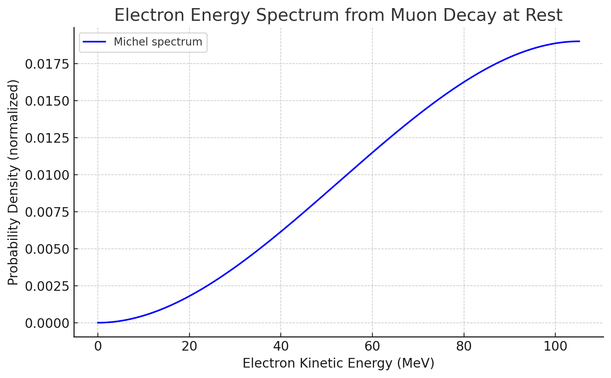

# Neutrinos, Muon Decay, and Dark Matter

## 1. Muon Decay and Energy Distribution

- A muon (μ⁻) decays as:
  ```
  μ⁻ → e⁻ + ν̅_e + ν_μ
  ```
- The mass of the muon (~105.7 MeV) is converted into:
  - Electron rest mass (~0.511 MeV)
  - Kinetic energy of the electron
  - Kinetic energy of the two neutrinos

- The **electron’s kinetic energy** ranges from ~0 MeV to ~52.8 MeV, averaging around **35 MeV**.

- The **Michel spectrum** describes the probability distribution of electron energy from muon decay. A more detailed version includes electron mass corrections.

## 2. Neutrinos and Their Energy

What about the decay products of the neutrinos? Do we ever see them eventually split into positron-electron pairs, for example?

**Neutrinos do not decay into electron-positron pairs or anything else—at least not in the Standard Model.**

#### Why Not?

Neutrinos are incredibly light (but not massless) and are fundamental particles in the Standard Model. According to our current understanding:

- They are stable (or at least so long-lived that no decay has ever been observed).

- They do not decay into other particles like electrons and positrons because:

  - There's no lighter particle (with matching quantum numbers) they could decay into.

  - Electron-positron pairs have more mass than a neutrino, so such a decay would violate energy conservation.

#### Could a High-Energy Neutrino Interact and Produce e⁺/e⁻ Pairs?

Yes, but that’s not decay — it's a scattering or interaction. For example:

- A high-energy neutrino hitting a nucleus can create an electron-positron pair via the weak interaction, but only if a heavy nucleus is present to conserve momentum and charge:

    𝜈 + 𝑁 → 𝜈 + 𝑁 + 𝑒+ + 𝑒 − ν + N → ν + N + e+ + e−
 
- This is called neutrino-induced pair production, but again, it's an interaction, not spontaneous decay.

#### Hypothetical Decay in New Physics?

Some exotic theories beyond the Standard Model (e.g. involving sterile neutrinos, or certain GUTs) do allow neutrinos to decay, but:

- These decays would produce lighter neutrinos and perhaps hypothetical particles, not electrons/positrons.
- No such decay has ever been observed.

#### Summary

- Neutrinos do not decay into electron-positron pairs.

- They are considered stable in the Standard Model.

- e⁺/e⁻ pairs can be produced in interactions, but not from neutrino decay.

Overall:

- Neutrinos, although nearly massless, **carry substantial kinetic energy**.
- This energy becomes **manifest only during interactions** (e.g., in a detector), where it transfers to detectable particles.
- Neutrinos are stable and travel through space without decaying.

### Visual: Neutrino Interaction Releasing Energy


---

## Muon Decay and Neutrinos

The muon has a mass of approximately 207 electron mass equivalents. If the muon decays into an electron and these two types of neutrinos, does the remaining mass of the muon  get converted into the energy of those neutrinos? Where does that mass go?

#### Key Idea

When a muon (μ⁻) decays:

  ```
  𝜇- → 𝑒− + 𝜈ˉ_𝑒 + 𝜈_𝜇
  ```

  ```
  μ⁻ → e⁻ + ν̅_e + ν_μ
  ```
 
the mass difference between the muon and the electron — which is very large (muon mass ≈ 105.7 MeV, electron mass ≈ 0.511 MeV) — is not lost, but is fully conserved by being converted into kinetic energy of the decay products.

#### Where Does the Muon Mass Go?

Let’s break it down:

- Initial system: A muon at rest (or with low momentum) has energy mostly in its rest mass, ~105.7 MeV.

- Final system:

  - An electron with a tiny rest mass (0.511 MeV) and significant kinetic energy

  - Two neutrinos, each with extremely small (effectively negligible) mass, but potentially tens of MeV of kinetic energy

The missing mass turns into:

- Kinetic energy of the electron

- Kinetic energy of the neutrinos

This follows Einstein’s equation:

  ```
  𝐸_total = 𝑚𝑐^2 + 𝑇_kinetic
  ```
 
The mass of the muon becomes energy, and that energy is divided among the motion (momentum and energy) of the decay products.

#### Why Don't We See the Neutrinos?

Because:

- Neutrinos interact incredibly weakly with matter

- In experiments, we measure only the electron

- The neutrinos carry away missing energy and momentum

- This "missing energy" was key to the discovery of neutrinos in the first place

#### Real-World Analogy

Think of it like this:

- A heavy spring-loaded ball (muon) explodes into a lighter ball (electron) and two fast, nearly invisible ping pong balls (neutrinos).

- The spring's stored energy is converted into the motion of all three.

- The heavy ball's rest energy doesn't disappear — it's fully conserved in the form of kinetic energy of the debris.

#### Conclusion

Yes — the muon’s mass is entirely accounted for in the decay. It doesn’t disappear. It becomes kinetic energy shared between:

- The electron (which you can detect)

- The two neutrinos (which you usually can’t)

It’s a beautiful, if frustrating, confirmation of energy and momentum conservation, even in the invisible realms.

## Energy Conversion to Electron Mass

What percentage of the energy is converted into the electron's kinetic energy? The electron must be moving very fast.

The electron can be moving very fast, but it doesn’t always get the bulk of the energy. In muon decay, the energy is shared randomly (within constraints) between the electron and the two neutrinos. This is a three-body decay, so the energy distribution is continuous, not fixed.

#### Key Facts:

- Muon rest energy: ~105.7 MeV

- lectron rest energy: ~0.511 MeV

- So: ~105.2 MeV available for kinetic energy among the three particles

#### How is that energy shared?

Because it's a three-body decay, the distribution of kinetic energy among the decay products is variable and determined by:

- Conservation of energy

- Conservation of momentum

- Weak interaction matrix elements (probabilities)

#### Electron’s kinetic energy:

- Minimum: Near zero (if neutrinos take almost everything)

- Maximum: About 52.8 MeV
(when both neutrinos take nearly zero energy — an unlikely but possible configuration)

So:

- The electron’s kinetic energy can be anywhere from 0 up to about 52.8 MeV, depending on the decay kinematics.

#### Typical / Average Value?

The **average kinetic energy** of the electron is roughly:

```
⟨𝑇_𝑒⟩ ≈ 35 MeV
```

This is around one-third of the available energy.

So:

- ~1/3 of the energy goes to the electron

- ~2/3 is split between the two neutrinos

This is not exact, but it's a good estimate from experimental spectra.

#### How fast is the electron?

Using relativistic energy:

```
𝐸 = sqrt(𝑝^2𝑐^2 + 𝑚^2c^4)
```

and kinetic energy,
```
𝑇 = 𝐸 − 𝑚𝑐^2
```
an electron with 35 MeV of kinetic energy is highly relativistic, moving at more than 99.98% the speed of light.

#### Summary

- The electron typically carries ~30–35 MeV of kinetic energy.

- That’s about one-third of the total decay energy.

- It moves extremely fast — relativistically.

- The rest of the energy goes into the neutrinos, which escape detection in most experiments.

The diagram below illustrates the electron energy spectrum from muon decay at rest



#### Michel spectrum

It is a plot of the Michel spectrum, which describes the probability distribution of electron kinetic energy from muon decay at rest.

- The horizontal axis shows the electron kinetic energy (up to ~52.8 MeV).

- The vertical axis shows the normalized probability density.

As you can see:

- The spectrum peaks around 35 MeV, aligning with our estimate of the average energy.

- There is a smooth drop-off toward the maximum energy (~52.8 MeV), where both neutrinos take minimal energy.

- Very low-energy electrons are also possible, though less likely.

This curve captures the essence of three-body decay randomness under weak interaction dynamics. Let me know if you'd like to overlay the corresponding speed or Lorentz factor of the electron. 

The Michel spectrum is both:

#### 1. Theoretically Derived

It was originally calculated by Louis Michel in 1950 using:

- The V–A theory of the weak interaction (vector minus axial vector),

- Assumptions of muon decay at rest,

- Neglecting the electron mass for simplicity (though more precise forms include it).

The derivation predicts the shape of the energy spectrum for the electron (or positron) produced in muon decay:
```
𝑑
Γ
𝑑
𝐸
∝
𝐸
2
(
3
−
4
𝐸
𝐸
max
)
(simplified form)
dE
dΓ
​
 ∝E 
2
 (3−4 
E 
max
​
 
E
​
 )(simplified form)
```

This comes from quantum field theory, applying Fermi’s Golden Rule to the decay matrix elements.

#### 2. Experimentally Observed and Confirmed

The Michel spectrum has been:

-Measured with high precision in particle detectors,

-Confirmed repeatedly in experiments going back to the 1950s and 60s (CERN, Fermilab, PSI, etc.),

-Used as a standard candle for calibrating muon detectors.

Modern experiments, like MEG, Mu3e, and Muon g−2, depend on this spectrum and have verified it in fine detail — including tiny deviations caused by:

-Electron mass,

-Radiative corrections,

-Muon polarization effects,

-Potential beyond-Standard-Model contributions.

#### Summary

- The Michel spectrum is a theoretical prediction from weak interaction physics.

- It has been thoroughly confirmed by experimental data.

- It provides a precise test of the Standard Model — and deviations from it would signal new physics.

Here’s the more detailed Michel spectrum, which includes the effects of the electron’s mass (~0.511 MeV) in the calculation.

Compared to the simplified version:

- The spectrum starts slightly above zero rather than rising immediately — a subtle but real effect of the electron mass threshold.

- The overall shape is similar, but more accurate, especially near the low- and high-energy endpoints.

This refined spectrum matches what is observed in precision experiments. It demonstrates just how well theoretical predictions from quantum field theory align with actual detector measurements, and how subtle corrections matter when testing the Standard Model to high precision.


## 3. Gamma Rays vs Neutrinos

| Property        | Neutrino                        | Gamma Ray (Photon)               |
|----------------|----------------------------------|----------------------------------|
| Particle type  | Fermion (spin-½)                | Boson (spin-1)                   |
| Mass           | Tiny (nonzero)                  | Zero                             |
| Interaction    | Weak force only                 | Electromagnetic force            |
| Energy carrier | Kinetic                         | Electromagnetic radiation        |
| Detectability  | Rare interactions               | Readily detectable via ionization|

## 4. Neutrinos and Dark Matter

- Neutrinos were early candidates for dark matter:
  - Dark, massive, stable, abundant
- But they fail to match **cold dark matter** properties:
  - They are **too fast** (hot dark matter)
  - They **don’t clump** efficiently
  - Their total mass is **too small**

## 5. Speculative Idea: Neutrino Self-Interaction

- Proposal: Neutrinos could **slow down** over time via interactions with each other.
- If they lost kinetic energy this way, they might **gravitationally coalesce** into structures like cold dark matter.
- Problem: In the Standard Model, neutrino-neutrino interactions are **far too weak** for this to happen.

## 6. Beyond the Standard Model: Self-Interacting Neutrino Dark Matter

- Some extended models propose:
  - New forces allowing neutrinos to scatter more often.
  - Sterile neutrinos that behave more like cold dark matter.
  - Neutrino condensates or hidden-sector interactions.

### Visual: Self-Interacting Neutrinos Coalescing into Dark Matter


## Summary

Neutrinos are a fascinating bridge between visible matter and dark phenomena. Though not sufficient to explain dark matter alone, they may still play a role in extended theories — especially if new self-interacting mechanisms exist.

---

Generated by ChatGPT at your request.
